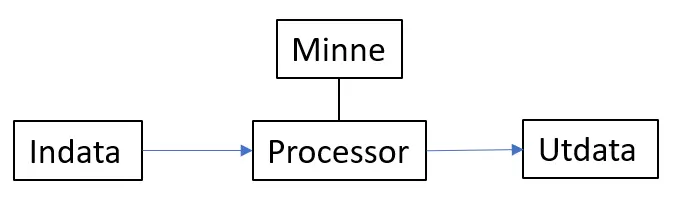

# Datorer och Programmering

## Datorprogram
När man talar om datorer, inkluderar detta inte bara vanliga persondatorer eller bärbara datorer, utan också mobiler och surfplattor. Datorer används även som komponenter i olika tekniska apparater såsom mikrovågsugnar, tvättmaskiner, leksaker, bilar, trafikljus, hissar och robotgräsklippare.

Datorer är numera en självklar del av våra liv och för att dessa ska fungera behöver de programmeras av människor. Programmering handlar om att skriva instruktioner som en dator kan förstå och utföra. Instruktionerna kallas **källkod** (kod) eller program (datorprogram) och skrivs i ett programmeringsspråk.

När ett program utförs (körs) i en dator säger man att programmet **exekveras**.

## Hur fungerar en dator?
Enkelt uttryckt är en dator en "maskin" som följer tydliga instruktioner och har till uppgift att: Ta in information (indata), behandla och lagra informationen samt presentera informationen igen (utdata).

En dator kan egentligen bara en sak, nämligen skilja på två tillstånd, ström på och av. Dessa tillstånd brukar kallas för ettor och nollor. All information i en dator lagras som ettor och nollor.

En dator kan förenklat ses som att den är uppbyggd av följande delar:

### Indata  
Att ge information till en dator kan ske med t.ex. tangentbord, mus eller mikrofon. En dator i en robotgräsklippare kan få information från olika sensorer som t.ex. känner av om något är i vägen.  

### Processor  
Även känt som CPU (Central Processing Unit), datorns "hjärna", där alla instruktioner utförs, dvs där programmet körs (exekveras). Den kan hantera ett visst antal instruktioner. Olika datorer kan ha olika typer av processorer.  
### Minne 
Programmet som ska köras läggs i datorns minne. Det är härifrån processorn hämtar instruktioner. Processorn kan även använda minnet för att lagra information medans programmet körs.  
### Utdata
Att visa information från en dator kan ske till t.ex. en skärm, högtalare eller skrivare. En dator i en robotgräsklippare kan ha t.ex. en lite skärm (display) eller blinkade lysdioder.  

## Program
Ett program är en följd av instruktioner, där varje instruktion representeras av ett antal ettor och nollor. Datorn är oerhört snabb på att skilja på dessa ettor och nollor, vilket möjliggör skapandet av olika typer av program.

När ett program är skrivet som en serie av ettor och nollor kallas det för maskinkod. Ett program måste vara i maskinkod för att datorns hårdvara (t.ex. processor, minne) ska kunna förstå programmet och köra det. Maskinkoden ser olika ut beroende på vilken typ av processor datorn har och därför kan inte maskinkod flyttas till en dator med en annan processortyp. Ordet hårdvara (från engelskans hardware) är ett samlingsnamn för datorns fysiska delar, dvs alla de saker man kan ta på. 

Datorn förstår ju bara maskinkod (ettor och nollor), men det är ett språk som är svårt för oss människor. Därför har programmeringsspråk skapats som är enklare för oss människor att skriva och läsa, och som sedan kan översättas till maskinkod. 

Program som skrivs med hjälp av ett programmeringsspråk kallas för källkod. Ofta används det förkortade kod, när man menar källkod. 

## Kompilering & Interpretering
När man skriver källkod måste man använda ett specifikt programmeringsspråk och följa dess **syntax**, som är reglerna för hur koden ska skrivas. De flesta programmeringsspråk är på engelska.

För att datorn ska kunna köra koden måste den översättas till maskinkod. Det finns två sätt att göra detta: kompilering och interpretering. Kompilerade språk översätter koden i förväg, medan interpreterade språk översätter den i realtid när programmet körs.

### Kompilerade språk
Exempel på kompilerade språk är C#, Java, C, C++ och Objective-C. Kompilatorn översätter koden till maskinkod innan den körs.

Fördelar:

- Snabb exekvering.
- Tidiga upptäckter av syntaxfel.

Nackdelar:

- Extra steg med kompilering.
- Krav på specifik processortyp.

Kompilerade språk används när effektivitet och felsäkerhet är viktigt.

### Interpreterade språk
Exempel på interpreterade språk är Python, JavaScript, PHP och Ruby. Interpreteraren översätter och tolkar koden under exekvering.

Fördelar:

- Portabilitet.
- Ingen kompileringsprocess.

Nackdelar:

- Långsammare exekvering.
- Risk för syntaxfel vid körning.

## Låg- och högnivåspråk
Det finns många olika programmeringsspråk att välja mellan, som till exempel Python, C#, C++, Java, Javascript och C. 

Varje språk har sina egna fördelar och är bra på olika saker. Till exempel är C ofta användbart för att styra maskiner och apparater, medan Java är känt för att vara bra för att skapa stora datorprogram. När det gäller spelutveckling är C++ ett populärt val, medan C# används för att utveckla olika typer av applikationer och spel, och HTML, CSS och Javascript ofta används för att skapa webbsidor på nätet.
### Lågnivåspråk
Historiskt sett när datorer programmerades användes lågnivåspråk, där koden var mycket detaljerad och väldigt nära det språk som datorn pratar (maskinkod). Det krävde exakt specificerade instruktioner, vilket gav full kontroll över programmet. Lågnivåspråk används idag främst för små inbyggda system, exempelvis mikrovågsugnar. Exempel på lågnivåspråk är assembler.
### Högnivåspråk
Nästa steg i utvecklingen var mer avancerade programmeringsspråk, s.k. högnivåspråk. I dessa skrivs programmet på ett sätt som är lättare att förstå för människor.  I högnivåspråk fokuserar man på att beskriva vad som ska göras istället för exakt hur det ska göras.  Högnivåspråk måste konverteras till maskinkod med hjälp av en interpretator eller kompilator, beroende på vilket programmeringsspråk som används. Det är kompilatorn eller interpretatorn som styr hur koden utförs på detaljnivå.

De vanligaste språken har fler likheter än olikheter, och alla innehåller instruktioner för:

- Sekvens - Instruktioner som sker i tur och ordning.
- Villkor - Styr vilka instruktioner som ska utföras.
- Repetition - Upprepning av instruktioner.

## Vad är C\#?
C# (uttalas "C sharp") är ett programmeringsspråk som utvecklats av Microsoft och introducerades år 2000.

C# skapades med målet att vara ett modernt, kraftfullt och lättanvänt språk för att utveckla olika typer av program och applikationer för Microsoft-plattformar som Windows. Men med tiden har språket blivit alltmer plattformsoberoende och numer kan man skriva och köra sina program på olika operativsystem som Windows, Linux och macOS. 

Ett av de mest intressanta dragen med C# är dess nära koppling till Microsofts .NET-plattform. Detta betyder att C#-program kan dra nytta av .NET:s stora ekosystem av bibliotek och verktyg för att snabbt och effektivt bygga robusta och skalbara applikationer.

C# har blivit ett populärt programmeringsspråk tack vare dess användarvänlighet, kraftfulla funktioner och breda användningsområden, vilket inkluderar allt från desktopapplikationer till webbutveckling och spelprogrammering. För nybörjare är C# ett utmärkt val för att lära sig grunderna i programmering samtidigt som det erbjuder tillräckligt med funktionalitet för att hantera mer avancerade projekt.

## C# jämfört med C/C++
C# är ett högnivåspråk med moderna funktioner och starkt stöd för objektorienterad programmering, vilket gör det enklare att utveckla och underhålla program jämfört med C och C++. Medan C och C++ är närmare knutna till datorns hårdvara och erbjuder mer direkt kontroll, ger C# en högre abstraktionsnivå och plattformsoberoende genom Microsofts .NET-plattform.

## IDE - Integrated Development Environment
Även känt som *"programmet som man skriver kod i."*

En IDE, eller Integrated Development Environment, är en programvara som erbjuder utvecklare en komplett miljö för att skriva, testa, felsöka och distribuera program. Den kombinerar vanligtvis textredigerare med andra funktioner såsom kodkomplettering och felsökning.

Vi kommer att använda Visual Studio Community Edition för att skriva och utveckla C#-program. Visual Studio är en kraftfull och populär IDE utvecklad av Microsoft och erbjuder ett brett utbud av funktioner och verktyg som underlättar utvecklingsprocessen. Community Edition är gratis för studenter och enskilda utvecklare.

Förutom Visual Studio finns det också andra populära IDE:er såsom Rider och Visual Studio Code. Utöver detta kan man också hitta webbaserade IDE:er online, exempelvis Replit. 