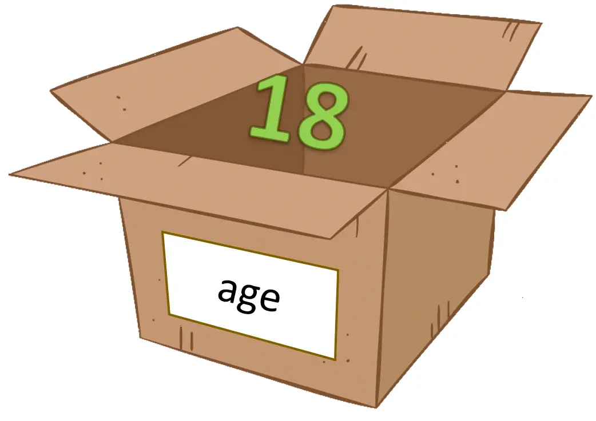

# Variabler

Ibland när man räknar ut något kan man inte utföra hela beräkningen på en gång, utan gör det i steg, räknar ut en sak i taget och skriver ned sina delresultat för att sedan kunna beräkna slutresultatet.

På motsvarande sätt kan beräkningar i ett datorprogram utföras stegvis, och information måste sparas för att kunna användas senare. Informationen sparas i **variabler,** namngivna objekt vars värde kan variera. 

Ett sätt att tänka på en variabel är som en låda som man kan lägga värden i. Ett program kan innehålla många variabler så varje variabel har ett eget namn.
{: width="40%"}

När man **deklarerar** (skapar) en variabel behöver man ange dess datatyp och dess namn. Om man sedan ger variabeln ett värde kallas det för **tilldelning**. Man tilldelar variabeln ett värde med hjälp av ett likhetstecken, variabeln är alltid på vänster sida.

```csharp
// Deklarerar en variabel av datatypen int.
int age;  
// Tilldelar värdet 18 till variabeln age.
age = 18;
```
{: width="40%"}

Detta kan utföras på en rad, om man redan från början vet vad värdet ska vara. Detta kallas för **initiering**.
```csharp
// Initierar variabeln myName.
string myName = "Emil"; 
```

Flera variabler av samma datatyp kan deklareras i samma sats (på samma rad). Detta gäller även tilldelning.
```csharp
// Deklarerar tre variabler av typen int.
int a, b, c; 

// Tilldelar de tre variablerna värdet 5.
a = b = c = 5; 
```

Variablers värde kan ändras under programmets körtid.
```csharp
string myName = "Emil";

// Tilldelar variabeln ett nytt värde.
myName = "Anna"; 

// Skriver ut variabelns värde.
Console.WriteLine(myName); // Ger utskriften Anna.
```

Variabler kan tilldelas värden från andra variabler.
```csharp
// Initierar a till 2. Tilldelar b värdet från a, alltså två.
int a = 2;
int b = a; 

// Tilldelar b sitt eget värde plus 10, alltså 12.
b = b + 10; 
```


## Variabelnamn
Ge alltid variabler tydliga förklarande namn, så att det tydligt framgår vad variabeln ska användas till. Ett namn kan innehålla bokstäver och siffror, men inte börja på en siffra. Det är skillnad på små och stora bokstäver. 

Det finns många olika sätt att namnge variabler. I C# används **camelCase** för vanliga variabler. Inledande gemen (liten bokstav), där varje nytt ord i variabeln inleds med versal (stor bokstav). Inga mellanslag eller understreck. 

Det finns även en del ord som är reserverade av C#, som inte kan användas som variabelnamn, dessa kallas nyckelord.

```csharp
int maxValue;  // JA
int MaxValue;  // NEJ, stor bokstav i början
int maxvalue;  // NEJ, saknar stor bokstav på andra ordet
int max_value; // NEJ, understreck
int max value; // ERROR, inga mellanslag
int int;       // ERROR, int är ett reserverat nyckelord
```

Riktlinjer för namngivning av variabler:

- I den här kursen får du välja själv om du använder svenska eller engelska variabelnamn. Men var konsekvent genom ditt projekt. Antingen är alla variabelnamn i projektet på svenska, eller på engelska.
  
- Ha hellre ett lite längre och beskrivande namn än en mer eller mindre obegriplig förkortning. Ditt framtida jag kommer tacka dig när denne  läser kod du skrivit.
  
- Använd camelCase.

