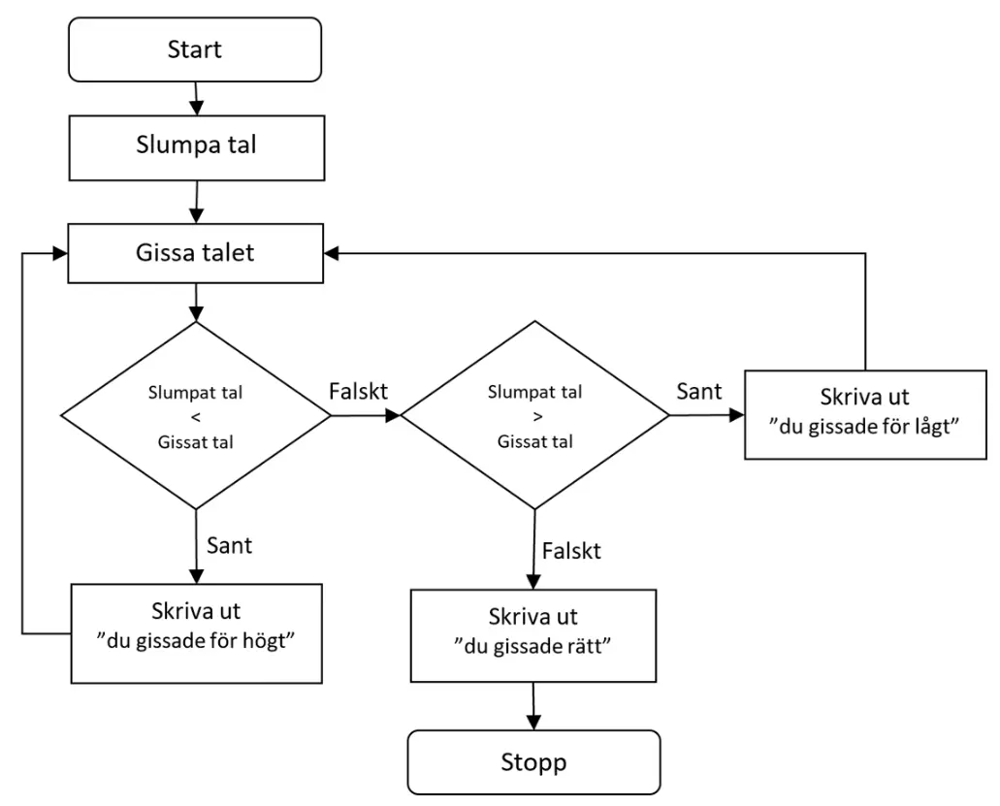

# Algoritmer, Pseudokod och Aktivitetsdiagram

Vid utvecklande av större program kan man oftast inte bara börja skriva kod direkt. En tänkbar arbetsgång vore något i stil med:

- Förstå problemet
- Fundera ut en potentiell lösning
- Skriv kod för din lösning
- Testa och utvärdera

Programmering handlar alltså inte bara om att skriva kod, utan även om problemlösning, hur man använder kod för att lösa problemet ifråga. 

## Algoritmer
En dator gör exakt det som den blir tillsagd att göra, därför är det viktigt att vara väldigt tydlig med instruktionerna, alltså källkoden. En algoritm är en exakt beskrivning av hur man löser ett problem. Den innehåller instruktioner som steg för steg talar om vad som ska göras.

Algoritmer kan användas i andra sammanhang än programmering, exempelvis är ett bakningsrecept en slags algoritm, eller för den delen en instruktionsbok/bruksanvisning.

En algoritm är alltså en metod för att lösa ett problem genom att utföra ett antal instruktioner i en given ordning. Metoden ska efter ett ändligt antal instruktioner nå lösningen.

---

## Pseudokod
Algoritmer kan uttryckas på olika sätt, ett sätt är att blanda vanligt språk och programmeringstermer, pseudokod. 

Pseudokod har inga hårda regler, vilket innebär att man kan strunta i detaljerna och fokusera på hur själva problemet ska lösas. Det är viktigt att vara tydlig så att inga missförstånd uppstår.

Pseudokoden kan sedan vara ett bra stöd när man skriver det riktiga programmet.

Nedan följer två exempel på pseudokod, de skiljer sig lite åt men båda fungerar bra.
```
// Exempel på pseudokod - Tänk på ett tal   
Tänk på ett heltal (1-20)   
Addera 1   
Multiplicera med 2   
Subtrahera 6   
Halvera   
Addera 3   
Subtrahera ditt ursprungliga tal   
Nu har du fått talet 1! 
```

```
// Exempel på pseudokod - Är du myndig?
Starta 
	Läs in ålder 
	Om ålder är större än eller lika med 18 
		Skriv ut "Du är myndig." 
	Annars 
		Skriv ut "Du är inte myndig." 
	Slut på om 
Sluta
```

!!! tip "Tips"
    Pseudokod är vanligt språk eventuellt blandat med programmeringstermer och kanske det minst formella sättet att beskriva en algoritm.


---

## Aktivitetsdiagram
Aktivitetsdiagram är en typ av flödesschema som  kan användas för att både planera men också visualisera logiken i ett program. 

Nedan presenteras ett aktivitetsdiagram för ”Gissa Talet”. Datorn slumpar fram ett tal, t.ex. mellan 1 – 100. Användaren ska på så få gissningar som möjligt gissa vilket tal datorn slumpat fram. För varje gissning användaren gör svarar datorn antingen: du gissade för lågt, du gissade för högt eller du gissade rätt. Om gissningen inte är korrekt ska användaren göra en ny gissning och det ska upprepas tills användaren gissat rätt.




Notera att olika symboler har olika betydelse. 
- Rektangel med rundade hörn för start respektive stopp av program.
- Vanlig rektangel för vanlig sekvens av kod.
- Romben motsvarar en selektion, if eller switch.
- Pilarna tillbaka till sekvensen "Gissa talet" representerar en iteration, loop.

!!! tip "Tips"
    Ett aktivitetsdiagram, som är en typ av flödesschema, är ett formellt sätt att beskriva en algoritm och den kan direkt översättas till källkod eftersom den består av symboler som direkt kan översättas till källkod.


