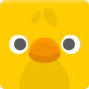

# MonoGame

Beskrivande flufftext här!

Modul 7 har ej uppdaterats från pdf. Alltså tittar man på pdf-arna.

[Installera MonoGame](monoguide-24/Installera%20MonoGame.pdf){:target="_blank"}

[1. Lägga in bild](monoguide-24/1%20Lägga%20in%20bild.pdf){:target="_blank"}

[2. Storlek och rotation](monoguide-24/2%20Position,%20storlek%20och%20rotation.pdf){:target="_blank"}

[3. Rörelse](monoguide-24/3%20Rörelse.pdf.pdf){:target="_blank"}

[4. Tangentbord och mus](monoguide-24/4%20Inmatning.pdf){:target="_blank"}

[5. Text och ljud](monoguide-24/5%20Text%20och%20ljud.pdf){:target="_blank"}

[6. Enkel kollision](monoguide-24/6%20Enkel%20kollision.pdf){:target="_blank"}

[7. Enkel animation](monoguide-24/7%20Enkel%20animering.pdf){:target="_blank"}

För bilder och ljud kan man såklart leta på internet efter gratis "game-assets", finns väldigt mycket sånt. 

Personligen har jag hämtat mycket från [kenney.nl](https://kenney.nl/).

Om sidan fortfarande är blockerad, dumma IT-avdelningen, jag har bett dem sluta blockera den, så antingen dela internet från telefonen, eller ta del av några bilder direkt här nedanför, högerklicka och ladda ned.

Ladda ner hela paketet "animal pack remastered" [här](img/kenney_animal-pack-remastered.zip).

